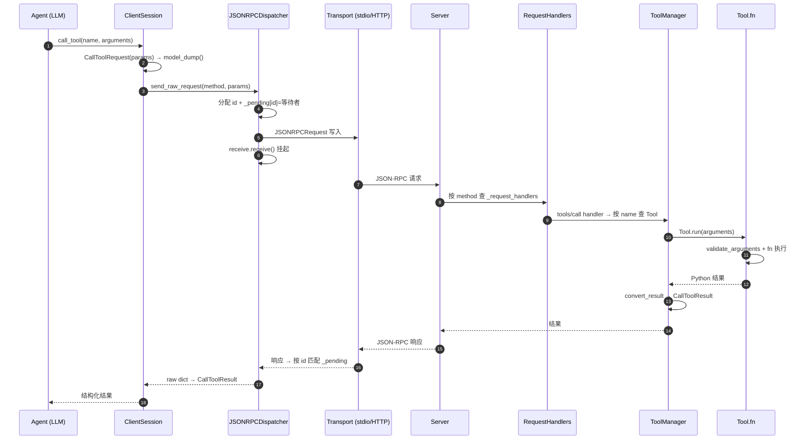
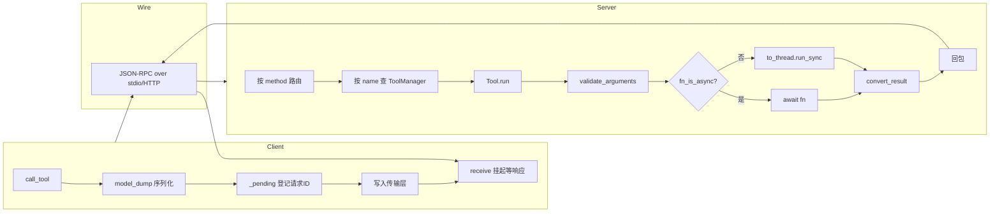

# W5 · MCP SDK 工具调用链路精读

> 源码：`/Users/vuji/workspace/github/python-sdk`（modelcontextprotocol/python-sdk）
> 精读目标：追踪 `call_tool` 从客户端入口到服务端 handler 执行的完整链路

## 一、调用链路全景（Client → Server）

### 客户端（发送端）

```
Agent 想调用 search_catalog
    ↓
ClientSession.call_tool(name="search_catalog", arguments={...})
    ↓ ① 构造请求对象
types.CallToolRequest(params=CallToolRequestParams(name, arguments))
    ↓ ② 序列化
request.model_dump(by_alias=True, mode="json", exclude_none=True)
    → 得到 dict：{"jsonrpc":"2.0","id":7,"method":"tools/call","params":{...}}
    ↓ ③ 交给 dispatcher
JSONRPCDispatcher.send_raw_request(method, params, opts)
    ├─ 分配 request_id（自增）
    ├─ _pending[request_id] = 内存流等待者 (send/receive 配对)
    ├─ 构造 JSONRPCRequest 消息
    ├─ await self._write(msg)          ← 写入传输层（stdio/HTTP）
    └─ await receive.receive()          ← 挂起，等响应（类似 await Promise）
    ↓ ④ 响应回来
收到 JSON-RPC 响应 → 按响应里的 id 反查 _pending 表
    → 找到对应等待者 → 塞进 send 端 → receive 唤醒
    → 返回 raw dict
    ↓ ⑤ 类型化
call_tool 拿到 raw dict → _call_tool_adapter 转成 CallToolResult
    → validate_tool_result() 校验结果结构
    → 返回给调用方
```

### 服务端（接收端）

```
传输层收到 JSON-RPC 请求
    ↓ ① 第一层路由
method 字段 → _request_handlers 查表 → "tools/call" → on_call_tool
    ↓ ② 第二层路由
params.name → ToolManager._tools[name] → 找到 Tool 对象
    ↓ ③ Tool.run(arguments)
├─ [resolved_params 场景] validate_arguments 预校验 + resolve_arguments
├─ call_fn_with_arg_validation(fn, is_async, arguments)
│   ├─ validate_arguments(arguments)      ← 参数校验（jsonschema）
│   ├─ fn_is_async ?
│   │   ├─ 是 → await fn(**arguments)
│   │   └─ 否 → anyio.to_thread.run_sync(fn, ...)   ← 线程池包装，不卡事件循环
│   └─ 返回 Python 结果
├─ convert_result(result)                  ← 转 CallToolResult（结构化输出）
└─ 异常处理
    ├─ MCPError → 原样抛 → JSON-RPC error 响应（协议级错误）
    └─ 其他 → 包装 ToolError → CallToolResult(isError=True)（执行失败）
    ↓ ④ 序列化回包
JSON-RPC 响应（含 result 或 error）→ 传输层 → 客户端
```

## 二、架构图





## 三、MCP vs 手写 ToolRegistry：设计取舍

### 相同点（证明 W4 理解到位）

| 概念 | W4 手写 | MCP |
|---|---|---|
| 工具表 | `_tools: {name: {schema, fn}}` | `_tools: {name: Tool}` |
| 参数校验 | `validate_params()` | `validate_arguments()`（jsonschema）|
| 同步/异步分派 | `inspect.iscoroutinefunction` | `fn_is_async` + `to_thread.run_sync` |
| 未知工具 | `return {success: False}` | `raise ToolError` |

### 差异点（生产级 vs 玩具级的分水岭）

1. **请求-响应关联**：MCP 用 `_pending[id]` 表支持**并发**——同时发 N 个请求，响应乱序也能正确匹配。W4 串行调用用不到。
2. **错误分层**：MCP 区分 `MCPError`（协议错误→JSON-RPC error）和 `ToolError`（执行失败→isError）。W4 全部压成 `{"success": False}`，丢失"该不该重试"的信息。
3. **传输抽象**：MCP 的传输层（stdio/SSE/HTTP）可插拔，`send_raw_request` 不关心底层。W4 直接函数调用，没有"网络"概念。
4. **结果转换**：MCP 有 `convert_result` 把 Python 结果转协议结构（content/structuredContent）。W4 直接返回 dict。
5. **类型安全**：MCP 全程 Pydantic 类型化（Request/Response 都是 dataclass）。W4 用裸 dict。

### 结论

**如果让我用 MCP SDK 替换 W4 手写实现，要改的只有一层：**

- `tool_executor.py`（执行器）→ 换成 `@mcp.tool()` 装饰器注册 + `ToolManager` 自动管理
- `tool_registry.py`（注册表）→ 换成 MCP Server 的请求路由
- `agent.py`（Agent Loop）→ 基本不用改——`call_tool` 返回 `CallToolResult`，解析 `content` 提取文本即可

**但 W4 手写不是白费**——理解了 `_pending` 关联表、`ToolError` 分层、`to_thread` 线程池包装之后，用 MCP 时你知道每层在做什么，而不是黑盒调用。手写理解原理，SDK 做工程化，这正是项目"核心机制能手写复现，工程实现优先复用成熟开源"的原则。

## 四、精读后的五个问题答案

1. **JSON-RPC 消息格式**：`{"jsonrpc":"2.0","id":N,"method":"tools/call","params":{name,arguments}}`
2. **stdio vs SSE**：stdio 用管道读写 JSON 行（本地进程），SSE 用 HTTP 长连接（远程）。dispatcher 层不感知差异——传输层适配器隔离
3. **Server 注册工具**：`@mcp.tool()` 装饰器 → 收集到 ToolManager，暴露 `tools/list` / `tools/call` 两个 method
4. **失败处理**：无内置重试。`MCPError` 走协议 error，`ToolError` 走 isError——重试策略由调用方（Agent）实现，对应我 W5 的 RetryController
5. **替换成本**：只改执行层，Agent Loop 不动
