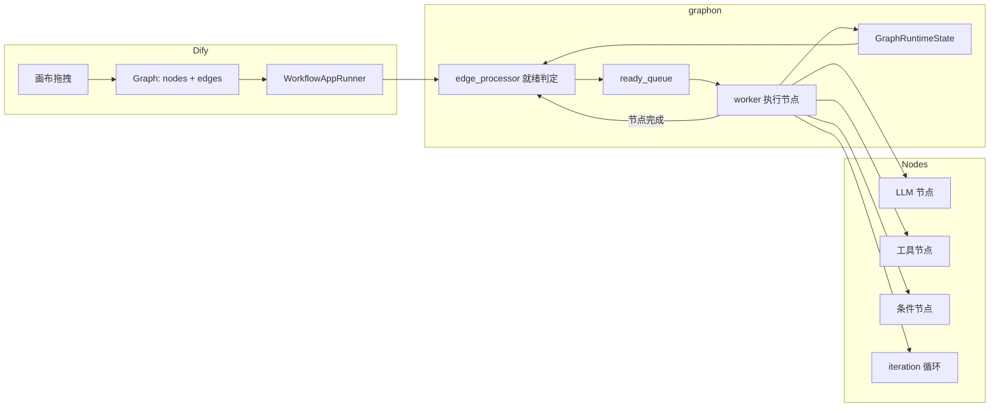

# W9 · Dify Workflow 引擎精读笔记

> 精读对象：Dify（langgenius/dify）的 workflow 引擎，核心是 graphon 0.6.0 库。
> 对比对象：自己 W8 手写的 ReAct / Plan-Execute 范式。

## 一、架构发现：引擎被抽成了独立库

Dify 的 workflow 引擎核心**不在 Dify 仓库里**——`api/pyproject.toml` 依赖 `graphon==0.6.0`（独立 PyPI 包）。
`api/core/workflow/` 只有业务节点（LLM 节点、知识库检索节点、工具节点）和 app 层编排。

```
Dify 仓库                        graphon 库（引擎）
api/core/app/apps/workflow/  →   graph/          （图定义）
api/core/workflow/nodes/     →   graph_engine/   （执行引擎）
api/core/workflow/node_factory.py → runtime/   （状态管理）
```

## 二、图定义：Graph = nodes + edges

`graphon/graph/graph.py`：
- `Graph` 类持有 `_nodes: dict[id, Node]` + `_edges: list[Edge]`
- `GraphBuilder` 提供 `add_node` / `add_edge`（链式构建）
- `Edge` 定义 `tail`（源）→ `head`（目标），可带条件（分支）

`api/core/workflow/graph_topology.py` 只是**查询工具**（86 行）：
- `has_node` / `is_upstream` / `upstream_node_ids`——回答"谁在谁上游"

## 三、执行引擎：就绪队列（dataflow）驱动

核心在 `graph_engine/graph_traversal/edge_processor.py`：

```
节点执行完
  → 处理它的出边（edge_processor）
  → 检查下游节点"所有入边是否都完成"
  → 都完成 → 标记 ready → 进 ready_queue
  → worker 从队列取节点执行
  → 循环直到图完成
```

**关键设计**：
1. **条件分支天然支持**：IF/ELSE 节点的出边带条件——只有满足条件的边让下游就绪，另一条边不触发
2. **并行天然支持**：多个节点同时就绪 → 并发执行（对比 W8 ReAct 的串行）
3. **循环用内置节点**：iteration 节点内部是子图循环，不依赖图本身有环

## 四、对比：graphon vs 手写 ReAct

| 维度 | 手写 ReAct（W8） | graphon 引擎 |
|---|---|---|
| 执行模型 | 代码写死的 for 循环 | 就绪队列驱动的数据流 |
| 分支 | 模型自己决定下一步 | 边的条件控制谁就绪 |
| 并行 | 无（串行）| 天然支持 |
| 循环 | MAX_STEPS 上限 | iteration 节点（子图循环）|
| 扩展 | 改代码 | 加节点类型（不改引擎）|
| 业务耦合 | 逻辑和循环耦合 | 引擎与业务解耦 |

## 五、对应表：graphon ↔ 自己的 W8 组件

| graphon / Dify 概念 | 我的 W8 组件 | 说明 |
|---|---|---|
| Graph（图）| PlanExecuteAgent 的 plan | 图是数据结构，plan 是列表——图表达力更强（可分支可并行）|
| Node（节点）| executor（工具执行）| 节点类型可扩展（LLM/工具/条件），executor 是单一接口 |
| edge_processor（就绪判定）| ReAct 的 for 循环 | 数据流 vs 代码流 |
| ready_queue | （无）| 并发调度器——ReAct 没有 |
| GraphRuntimeState（状态）| trace（对话历史）| 引擎状态是结构化节点输出，ReAct 是消息列表 |
| VariablePool（变量池）| ShortTermMemory | 节点间变量传递 vs 消息上下文 |

## 六、要回答的问题

1. **本质区别**：ReAct 是"代码写死的顺序执行"（循环体里调 LLM），graphon 是"数据驱动的数据流"（节点就绪即执行）。前者的执行逻辑和业务逻辑耦合，后者的引擎与业务解耦——这就是"数据驱动扩展性更高"的根源。
2. **毕业项目取舍**：如果用 Dify，复用它的引擎（图执行/并发/状态），手写自己的业务节点；如果自己搭，ReAct 适合探索型单 Agent，graphon 式引擎适合固定流程多节点。
3. **节点对应**：Dify 的 LLM 节点 = RouterClient；工具节点 = MCPToolAdapter；条件节点 = 分支逻辑；iteration = 循环。
4. **加重试节点**：在 edge_processor 里包一层——节点执行失败时判断错误类型（复用 W5 的 categorize_error），TRANSIENT 则重新入队而非推进下游。

## 七、架构图



**一句话总结**：Dify 的 workflow 是"数据驱动的图执行"——引擎只认"节点就绪 → 执行 → 推进下游"这个契约，业务逻辑全部在节点里。这是手写 ReAct（代码驱动）到生产级 Agent 编排（数据驱动）的架构升级。
